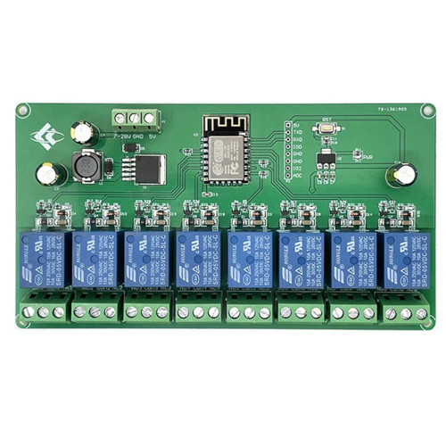
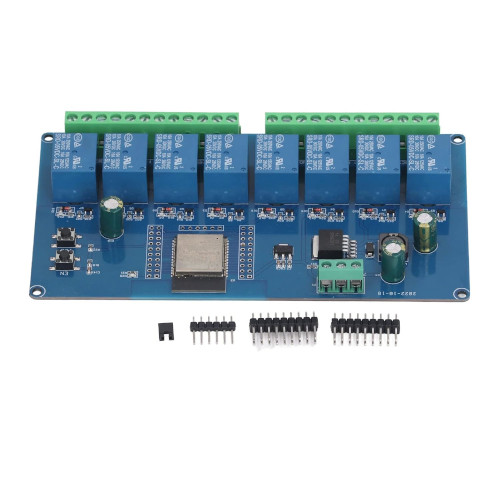

# Advent Wreath Control Software

A PlatformIO project to control an ddvent wreath.

Designed to be used with 8-chan relais board, controlled by a ESP32 or ESP8266 (ESP-12F,...).

Currrent Time is read from a DS3231 clock via I2C.

Controllable via WiFi.

Example Boards:

- 
- 
- AZDelivery DS3231 Clock
